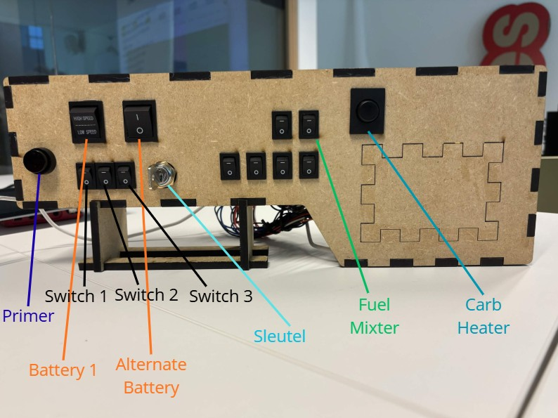

# Gebruikshandleiding — Simulator Cockpit

## Het paneel




---

## Opstartprocedure

Volg deze stappen **in volgorde** om de motor te starten:

---

### Stap 1 — Batterijen aanzetten

> Zet de **2 grote rocker schakelaars linksboven** aan.

- **Battery 1** (HIGH/LOW SPEED schakelaar) → omzetten naar **aan**
- **Alternate Battery** (I/O schakelaar) → omzetten naar **I (aan)**

---

### Stap 2 — Primer indrukken

> Druk het **ronde knopje helemaal links (Primer)** meerdere malen in.

- Druk de primer **6 keer** in
- In de game zie je de primerknop **heen en weer bewegen** bij elke druk

---

### Stap 3 — Carb Heater activeren

> Druk het **grote ronde knopje helemaal rechts (Carb Heater)** in.

- Druk **2 keer** op de Carb Heater knop

---

### Stap 4 — Fuel Mixter aanzetten

> Zet het **kleine schakelaarknopje (Fuel Mixer)** aan.

- Het Fuel Mixer schakelaarknopje bevindt zich rechts van de middelste knoppen
- Zet dit op **aan**

---

### Stap 5 — Magneto schakelaars aanzetten

> Zet de **3 kleine rocker schakelaars naast de sleutel** aan.

- **Switch 1** → aan
- **Switch 2** → aan
- **Switch 3** → aan

---

### Stap 6 — Motor starten met de sleutel

> Draai aan de **sleutel** en **houd deze vast**.

- Steek de sleutel in het sleutelslot (midden van het paneel)
- Draai de sleutel naar **start**
- **Houd de sleutel vast** totdat de motor aanslaat
- De motor start op

---

## Samenvatting opstartprocedure

```
1. Battery 1 AAN  ──► linksboven, grote schakelaar
2. Alternate Battery AAN  ──► naast Battery 1
3. Primer 6x      ──► rond knopje links, 6 keer indrukken
4. Carb Heater 2x ──► groot rond knopje rechts, 2x indrukken
5. Fuel Mixter AAN ──► klein schakelaarknopje midden-rechts
6. SW1 + SW2 + SW3 AAN ──► 3 kleine knoppen naast sleutel
7. Sleutel vasthouden ──► draaien en vasthouden → motor start
```
