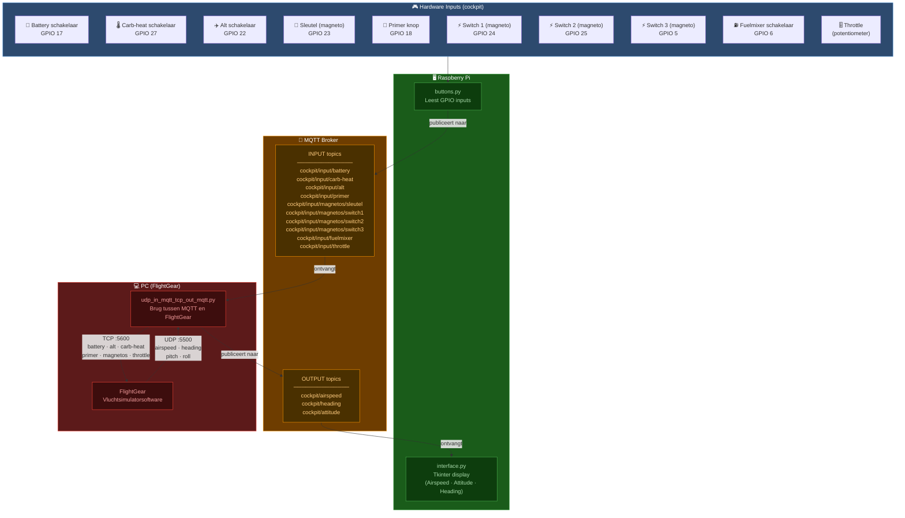

# Software Architectuur — Simulator Cockpit

## Overzicht

Het systeem bestaat uit 3 grote onderdelen die via **MQTT** met elkaar communiceren:
- **Raspberry Pi** — leest knoppen/schakelaars en toont de cockpit display
- **MQTT Broker** — centrale berichtenbus (IP: `10.10.229.190`)
- **PC (FlightGear)** — de vluchtsimulatorsoftware

---

## Architectuurschema

---

## Dataflow uitgelegd

### ➡️ Input: Cockpit → FlightGear

| Stap | Van | Naar | Protocol |
|------|-----|------|----------|
| 1 | Hardware knoppen/schakelaars | `buttons.py` (GPIO read) | GPIO |
| 2 | `buttons.py` | MQTT Broker (input topics) | MQTT publish |
| 3 | MQTT Broker | `udp_in_mqtt_tcp_out_mqtt.py` | MQTT subscribe |
| 4 | Bridge script | FlightGear | TCP poort 5600 |

### ⬅️ Output: FlightGear → Cockpit display

| Stap | Van | Naar | Protocol |
|------|-----|------|----------|
| 1 | FlightGear | Bridge script | UDP poort 5500 |
| 2 | Bridge script | MQTT Broker (output topics) | MQTT publish |
| 3 | MQTT Broker | `interface.py` | MQTT subscribe |
| 4 | `interface.py` | Scherm (Tkinter) | Tekent gauges |

---

## MQTT Topics

### Input topics (Pi → PC)

| Topic | Waarden | Omschrijving |
|-------|---------|--------------|
| `cockpit/input/battery` | `0` / `1` | Batterijschakelaar |
| `cockpit/input/carb-heat` | `0` / `1` | Carburateur verwarming |
| `cockpit/input/alt` | `0` / `1` | Alternatieve schakelaar |
| `cockpit/input/primer` | `0` / `1` | Primer knop (toggle) |
| `cockpit/input/magnetos/sleutel` | `0` / `1` | Contactsleutel (omgekeerd) |
| `cockpit/input/magnetos/switch1` | `0` / `1` | Magneto schakelaar 1 |
| `cockpit/input/magnetos/switch2` | `0` / `1` | Magneto schakelaar 2 |
| `cockpit/input/magnetos/switch3` | `0` / `1` | Magneto schakelaar 3 |
| `cockpit/input/fuelmixer` | `0` / `1` | Brandstofmengschakelaar |
| `cockpit/input/throttle` | `0.0` – `1.0` | Gashandel positie |

### Output topics (PC → Pi)

| Topic | Waarden | Omschrijving |
|-------|---------|--------------|
| `cockpit/airspeed` | `float` | Luchtsnelheid (km/u) |
| `cockpit/heading` | `0` – `360` | Kompasrichting (graden) |
| `cockpit/attitude` | `pitch,roll` | Vliegtuighouding |
